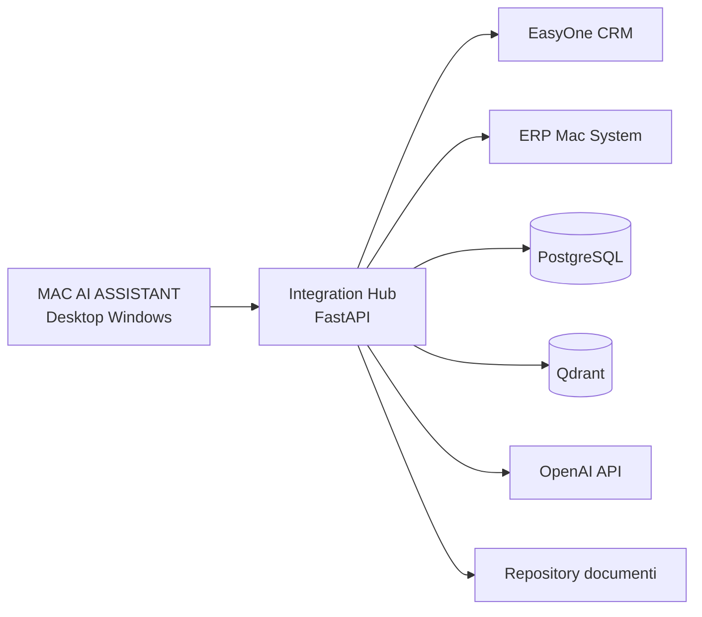
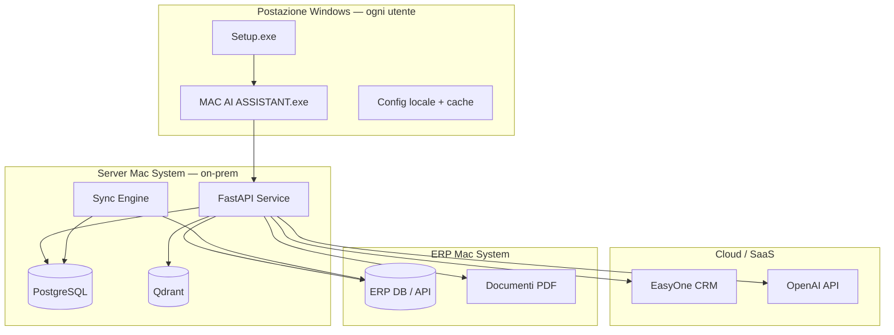
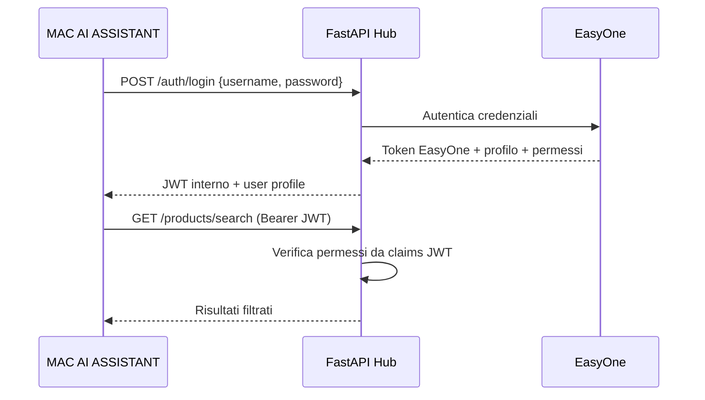

# MAC AI ASSISTANT
## Specifiche funzionali e tecniche

| Campo | Valore |
|---|---|
| **Prodotto** | MAC AI ASSISTANT |
| **Cliente** | Mac System |
| **Tipo** | Software desktop Windows installabile |
| **Versione documento** | 1.0 |
| **Data** | 5 giugno 2026 |
| **Stato** | Bozza per approvazione |

---

## 1. Introduzione

### 1.1 Scopo del documento

Definire in modo completo requisiti funzionali, requisiti tecnici, architettura, integrazioni e criteri di accettazione per **MAC AI ASSISTANT**, assistente desktop Windows per personale commerciale e magazzino di Mac System.

### 1.2 Obiettivo del prodotto

Fornire un'unica applicazione Windows che consenta a commerciale e magazzino di:

- accedere con le **credenziali EasyOne** e rispettare gli **stessi permessi**;
- consultare **catalogo, giacenze e documentazione** in tempo reale o quasi real-time;
- interagire con un **assistente AI** in linguaggio naturale;
- ottenere **suggerimenti commerciali** basati su compatibilità e storico vendite.

### 1.3 Utenti target

| Ruolo | Utilizzo principale |
|---|---|
| Commerciale | Catalogo, clienti, prezzi, cross/up-sell, assistente AI |
| Magazziniere | Giacenze, ubicazioni, schede tecniche, manuali |
| Back office | Consultazione ordini, documentazione |
| Amministratore | Configurazione locale, diagnostica (non gestione utenti) |

### 1.4 Fuori scope (v1.0)

- Creazione/modifica ordini e preventivi in EasyOne/ERP
- Gestione utenti locale
- App mobile iOS/Android
- Modulo contabilità / fatturazione autonomo

---

## 2. Contesto e integrazioni

### 2.1 Sistemi coinvolti



### 2.2 Principi di integrazione

| Principio | Descrizione |
|---|---|
| **Nessun utente locale** | Autenticazione e autorizzazione delegate a EasyOne |
| **ERP source of truth operativa** | Articoli, giacenze, listini, ordini |
| **EasyOne source of truth CRM** | Utenti, permessi, profili, relazioni commerciali |
| **Hub centralizzato** | L'app desktop non accede mai direttamente a DB ERP |
| **Cache intelligente** | PostgreSQL per catalogo indicizzato e sessioni |
| **RAG documentale** | Qdrant per PDF e schede tecniche |

### 2.3 Dipendenze esterne da confermare con Mac System

- Versione EasyOne (Cloud Buffetti)
- ERP collegato (TeamSystem, Zucchetti, Sage X3, ecc.)
- Disponibilità API EasyOne / ERP
- Policy IT su OpenAI (cloud vs Azure OpenAI)
- Percorso repository documenti (SharePoint, NAS, ERP allegati)

---

## 3. Requisiti funzionali

### 3.1 Autenticazione (AUTH)

#### AUTH-01 — Login EasyOne
- L'utente accede **esclusivamente** con credenziali EasyOne (username/email + password o SSO se configurato).
- Non esiste registrazione locale né recupero password nell'app (delegato a EasyOne).

#### AUTH-02 — Nessun utente locale
- Il sistema **non** memorizza utenti applicativi propri.
- Cache locale limitata a token di sessione e profilo utente corrente.

#### AUTH-03 — Permessi ereditati
- Ruoli e permessi letti da EasyOne a ogni login e refresh sessione.
- Permessi applicati a: listini, margini, clienti, depositi, documenti sensibili.

#### AUTH-04 — Sessione sicura
- Token JWT interno con scadenza configurabile (default 8 ore).
- Refresh token o re-login automatico prima della scadenza.
- Logout esplicito con invalidazione sessione.

#### AUTH-05 — Audit accessi
- Log di login/logout con timestamp, utente, postazione Windows.

**Criteri di accettazione AUTH**
- [ ] Login fallisce con credenziali EasyOne non valide
- [ ] Utente magazzino non visualizza margini se non autorizzato in EasyOne
- [ ] Nessuna funzione accessibile senza sessione valida

---

### 3.2 Catalogo (CAT)

#### CAT-01 — Accesso articoli in tempo reale
- Anagrafica articoli letta da ERP via Integration Hub.
- Latenza massima target: **≤ 2 secondi** per singola consultazione live.

#### CAT-02 — Ricerca per codice
- Ricerca esatta e parziale su: codice interno, EAN, codice fornitore (se disponibile).
- Supporto scanner barcode (input tastiera emulata).

#### CAT-03 — Ricerca per descrizione
- Full-text su descrizione, marca, categoria.
- Ranking per rilevanza.

#### CAT-04 — Ricerca libera
- Campo unico che interroga codice + descrizione + categoria + marca contemporaneamente.
- Suggerimenti autocomplete dopo 2 caratteri (debounce 300 ms).

#### CAT-05 — Scheda articolo
Per ogni articolo visualizzare:
- codice interno, EAN, produttore/marca
- descrizione estesa
- categoria merceologica (albero)
- prezzo listino applicabile al profilo utente
- unità di misura, peso, codice doganale (se presenti)
- link a documentazione associata
- stato articolo (attivo, fuori produzione, obsoleto)

#### CAT-06 — Filtri avanzati
- Categoria, produttore, disponibilità (>0), listino, stato.

**Criteri di accettazione CAT**
- [ ] Ricerca codice esatto restituisce articolo in < 1 s (cache)
- [ ] Ricerca descrizione "router wifi" restituisce risultati ordinati per rilevanza
- [ ] Prezzo mostrato rispetta listino del profilo utente EasyOne

---

### 3.3 Magazzino (MAG)

#### MAG-01 — Disponibilità in tempo reale
- Giacenza **live** da ERP (non solo cache) su richiesta esplicita o scheda articolo.
- Indicazione data/ora ultimo aggiornamento.

#### MAG-02 — Giacenze per deposito
- Quantità per ogni deposito/magazzino visibile all'utente in base ai permessi.
- Totale disponibile aggregato.

#### MAG-03 — Giacenza netta (opzionale v1.1)
- Disponibile al netto di ordini clienti in evasione e ordini fornitore in arrivo.
- Flag configurabile per abilitazione.

#### MAG-04 — Ubicazioni
- Visualizzazione ubicazione fisica: scaffale, corridoio, zona, piano (schema dipende da ERP).
- Ricerca articolo per ubicazione.

#### MAG-05 — Indicatori operativi
| Giacenza | Indicatore | Colore |
|---|---|---|
| 0 | Esaurito | Rosso |
| 1–10 | Scorte basse | Giallo |
| > 10 | Disponibile | Verde |

#### MAG-06 — Storico movimenti (v1.1)
- Ultimi N movimenti per articolo/deposito.

**Criteri di accettazione MAG**
- [ ] Modifica giacenza in ERP riflessa entro 60 s nella consultazione live
- [ ] Magazziniere vede solo depositi autorizzati
- [ ] Ubicazione mostrata se presente in ERP

---

### 3.4 Documentazione (DOC)

#### DOC-01 — Schede tecniche
- Visualizzazione inline o download PDF scheda tecnica collegata all'articolo.
- Apertura nel viewer integrato dell'app.

#### DOC-02 — Manuali PDF
- Elenco manuali associati per articolo/famiglia produttore.
- Ricerca full-text nei manuali indicizzati (RAG).

#### DOC-03 — Certificazioni
- CE, RoHS, REACH, garanzia, dichiarazioni conformità.
- Metadati: tipo documento, data, scadenza, ente certificatore.

#### DOC-04 — Indicizzazione documenti
- Pipeline ETL: estrazione testo → chunk → embedding OpenAI → Qdrant.
- Re-indicizzazione su nuovi file in cartella monitorata o sync ERP.

#### DOC-05 — Viewer integrato
- Visualizzatore PDF embedded nel frontend desktop.
- Download locale temporaneo con pulizia automatica.

#### DOC-06 — Fonti citate (AI)
- Ogni risposta tecnica AI cita: nome PDF, pagina, sezione.

**Criteri di accettazione DOC**
- [ ] Scheda tecnica aperta da scheda articolo in ≤ 3 click
- [ ] Ricerca "tensione alimentazione" trova estratto PDF con pagina citata
- [ ] Certificazione scaduta evidenziata visivamente

---

### 3.5 Assistente AI (AI)

#### AI-01 — Linguaggio naturale
- Input testuale in italiano (primario).
- Comprensione di: codici, descrizioni, domande tecniche, richieste commerciali miste.

#### AI-02 — Orchestrazione multi-sorgente
Per ogni domanda l'assistente esegue in sequenza/parallelo:

1. Ricerca catalogo (PostgreSQL + ERP live)
2. Ricerca PDF (Qdrant RAG)
3. Verifica disponibilità (ERP live)
4. Compatibilità (regole + DB locale)
5. Prodotti acquistati insieme (storico ordini)

#### AI-03 — Risposta strutturata
Output obbligatorio con sezioni:

| Sezione | Contenuto |
|---|---|
| **Risposta operativa** | Testo sintetico per commerciale/magazzino |
| **Articolo** | Codice, marca, categoria, prezzo |
| **Disponibilità** | Giacenza, stato, depositi |
| **Descrizione** | Testo commerciale/tecnico |
| **Documentazione** | Link PDF + sintesi tecnica da RAG |
| **Compatibilità** | Accessori, alternative, ricambi, complementari |
| **Suggerimenti commerciali** | Cross-sell con % correlazione |

#### AI-04 — Vincolo anti-allucinazione
- Risposte tecniche basate **solo** su PDF indicizzati e dati ERP/EasyOne.
- Messaggio esplicito se informazione non disponibile.

#### AI-05 — Suggerimenti compatibilità
- **Accessori compatibili** — regole ERP/EasyOne + inferenza documentale
- **Alternative** — prodotti sostitutivi equivalenti
- **Ricambi** — componenti di manutenzione
- **Complementari** — prodotti upsell logicamente correlati

#### AI-06 — Storico conversazioni
- Salvataggio conversazioni per utente in PostgreSQL.
- Ricerca conversazioni precedenti.

#### AI-07 — Filtro per articolo/contesto
- Conversazione contestualizzata su articolo selezionato nel catalogo.

**Criteri di accettazione AI**
- [ ] Domanda "RT-AX58U disponibilità e accessori" restituisce risposta strutturata completa
- [ ] Domanda tecnica su manuale cita PDF e pagina
- [ ] Nessun prezzo inventato se non presente in ERP

---

### 3.6 Vendite e raccomandazioni (SALE)

#### SALE-01 — Analisi storico ordini
- Import/sync periodico ordini da ERP.
- Calcolo co-occorrenze prodotti negli stessi ordini.

#### SALE-02 — Prodotti acquistati insieme
- Per articolo A, elenco articoli B, C, D con **percentuale correlazione**.
- Formula: `(ordini con A e B) / (ordini con A) × 100`.

#### SALE-03 — Cross selling
- Suggerimenti basati su correlazione storica (> soglia configurabile, default 30%).
- Ordinamento per % decrescente.

#### SALE-04 — Up selling
- Suggerimenti di prodotti fascia superiore nella stessa categoria/famiglia.
- Regole: stesso produttore, specifiche superiori, prezzo maggiore.

#### SALE-05 — Suggerimenti commerciali unificati
- Merge cross-sell + compatibilità + up-sell deduplicato per codice articolo.
- Motivazione per ogni suggerimento ("Acquistato insieme 72%", "Accessorio compatibile").

#### SALE-06 — Dashboard vendite (v1.1)
- Top articoli venduti, trend mensile, clienti frequenti per articolo.

**Criteri di accettazione SALE**
- [ ] Articolo con storico mostra almeno 3 suggerimenti con % se dati sufficienti
- [ ] Cross-sell non propone articoli obsoleti o esauriti (configurabile)

---

## 4. Requisiti non funzionali (NFR)

### 4.1 Performance

| Metrica | Target |
|---|---|
| Avvio applicazione | ≤ 5 s (post-installazione) |
| Login EasyOne | ≤ 3 s |
| Ricerca catalogo (cache) | ≤ 1 s |
| Giacenza live ERP | ≤ 2 s |
| Risposta assistente AI | ≤ 15 s (95° percentile) |
| Indicizzazione PDF (batch) | ≥ 100 pagine/min |

### 4.2 Disponibilità

- App desktop funziona offline in **modalità limitata** (cache catalogo, PDF già scaricati).
- Funzioni live (giacenza, prezzi, AI) richiedono connettività verso Hub.
- Hub target availability: 99.5% in orario lavorativo.

### 4.3 Sicurezza

- Comunicazioni TLS 1.2+ tra app e Hub.
- Token JWT firmati (RS256 o HS256 con chiave rotante).
- Credenziali EasyOne **mai** persistite in chiaro.
- Secrets in Windows Credential Manager o variabili ambiente protette.
- Audit log query su prezzi, margini, dati cliente.
- Conformità GDPR per log e conversazioni AI.

### 4.4 Usabilità

- Interfaccia in italiano.
- Layout ottimizzato per risoluzione minima **1366×768**.
- Supporto tastiera e scanner barcode.
- Font leggibile, contrasto WCAG AA.
- Feedback visivo su operazioni > 500 ms (spinner/progress).

### 4.5 Manutenibilità

- Logging strutturato (JSON) con livelli DEBUG/INFO/WARN/ERROR.
- Versioning semantico (MAJOR.MINOR.PATCH).
- Auto-update opzionale post-v1.0.

### 4.6 Compatibilità

| Requisito | Specifica |
|---|---|
| OS | Windows 10 22H2+ / Windows 11 |
| Architettura | x64 |
| .NET runtime | Incluso nell'installer se necessario |
| Python backend | 3.12 (embedded o servizio separato) |
| RAM minima | 8 GB |
| Spazio disco | 2 GB (app + cache) |

---

## 5. Architettura tecnica

### 5.1 Stack tecnologico

| Layer | Tecnologia |
|---|---|
| **Installer** | Inno Setup o WiX Toolset → `Setup.exe` |
| **Frontend desktop** | Electron + React **oppure** Tauri + React (raccomandato Tauri per footprint ridotto) |
| **Backend API** | Python 3.12 + FastAPI + Uvicorn |
| **Database relazionale** | PostgreSQL 16 |
| **Vector DB** | Qdrant 1.11+ |
| **AI** | OpenAI API (GPT-4o-mini / GPT-4o + text-embedding-3-small) |
| **ORM** | SQLAlchemy 2.x |
| **Migrations** | Alembic / SQL schema |
| **Auth** | JWT + EasyOne Auth Adapter |

### 5.2 Deployment modello consigliato



**Nota deployment v1.0:** il backend (FastAPI + PostgreSQL + Qdrant) risiede su **server aziendale**; l'app desktop è client leggero. Alternativa: bundle locale per singola postazione (solo piccole installazioni).

### 5.3 Struttura moduli backend

```
mac-ai-assistant/
├── app/
│   ├── main.py                    # FastAPI entry
│   ├── config/settings.py
│   ├── api/routes/
│   │   ├── auth.py                # Login EasyOne
│   │   ├── products.py            # Catalogo
│   │   ├── warehouse.py           # Giacenze / ubicazioni
│   │   ├── documents.py           # PDF / certificazioni
│   │   ├── chat.py                # Assistente AI
│   │   ├── recommendations.py     # Cross/up-sell
│   │   └── health.py
│   ├── integrations/
│   │   ├── easyone/               # Auth + CRM adapter
│   │   ├── erp/                   # ERP adapter Mac System
│   │   ├── openai/
│   │   └── qdrant/
│   ├── services/
│   │   ├── commercial_assistant_service.py
│   │   ├── auth_service.py
│   │   ├── catalog_service.py
│   │   ├── warehouse_service.py
│   │   └── sync_service.py
│   ├── models/
│   ├── repositories/
│   └── ingestion/
├── desktop/                       # Frontend Electron/Tauri
├── installer/                     # Script Setup.exe
├── database/schema.sql
└── docs/
```

### 5.4 API REST principali

| Metodo | Endpoint | Descrizione |
|---|---|---|
| POST | `/api/auth/login` | Login EasyOne → JWT |
| POST | `/api/auth/logout` | Logout |
| GET | `/api/auth/me` | Profilo e permessi |
| GET | `/api/products/search` | Ricerca catalogo |
| GET | `/api/products/{code}` | Dettaglio articolo |
| GET | `/api/warehouse/stock/{code}` | Giacenza live |
| GET | `/api/warehouse/locations/{code}` | Ubicazioni |
| GET | `/api/documents/{code}` | Documenti associati |
| POST | `/api/chat/ask` | Assistente AI strutturato |
| GET | `/api/recommendations/{code}` | Cross/up-sell |
| GET | `/api/health` | Health check |

### 5.5 Schema database PostgreSQL (assistente)

Oltre alle tabelle già progettate:

| Tabella | Scopo |
|---|---|
| `products` | Cache catalogo ERP |
| `product_compatibility` | Accessori, alternative, ricambi |
| `orders` / `order_lines` | Storico per raccomandazioni |
| `product_cooccurrence` | Correlazioni calcolate |
| `documents` | Metadati PDF |
| `conversations` / `messages` | Storico chat AI |
| `audit_logs` | Tracciabilità accessi |
| `sync_status` | Stato sincronizzazioni ETL |
| `user_sessions` | Sessioni attive (token hash) |

### 5.6 Integrazione EasyOne — adapter auth



---

## 6. Frontend desktop

### 6.1 Tecnologia consigliata

| Opzione | Pro | Contro |
|---|---|---|
| **Tauri + React** | Binario leggero, nativo Windows, sicuro | Curva learning Rust (solo shell) |
| **Electron + React** | Ecosistema maturo, veloce da sviluppare | Footprint RAM/disco maggiore |

**Raccomandazione:** Tauri 2 + React + TypeScript + Tailwind CSS.

### 6.2 Schermate principali

| # | Schermata | Descrizione |
|---|---|---|
| 1 | **Login** | Username/password EasyOne, logo Mac System |
| 2 | **Home / Dashboard** | Ricerca rapida, ultimi articoli, accesso chat |
| 3 | **Catalogo** | Ricerca, filtri, lista risultati |
| 4 | **Scheda articolo** | Dettaglio completo + tab magazzino/doc/AI |
| 5 | **Magazzino** | Giacenze per deposito, ubicazioni |
| 6 | **Documenti** | Viewer PDF, certificazioni |
| 7 | **Assistente AI** | Chat con risposta strutturata a sezioni |
| 8 | **Suggerimenti vendita** | Cross/up-sell per articolo |
| 9 | **Impostazioni** | URL server Hub, diagnosi connessione |

### 6.3 Wireframe logico — Scheda articolo

```
┌─────────────────────────────────────────────────────────┐
│  MAC AI ASSISTANT          [Utente] [Logout]            │
├─────────────────────────────────────────────────────────┤
│  🔍 Cerca articolo...                                   │
├─────────────────────────────────────────────────────────┤
│  RT-AX58U — ASUS Router Wi-Fi 6 AX5700                  │
│  Networking > Router > Wi-Fi 6                          │
│  Prezzo: € 129,90    ● Disponibile (24 pz)              │
├──────────┬──────────┬──────────┬──────────┬──────────────┤
│ Generale │Magazzino │ Documenti│    AI    │  Vendite     │
├──────────┴──────────┴──────────┴──────────┴──────────────┤
│  [Contenuto tab selezionato]                            │
│  - Giacenze per deposito                                │
│  - Ubicazioni                                           │
│  - PDF / certificazioni                                 │
│  - Chat AI contestuale                                  │
│  - Cross-sell / up-sell                                 │
└─────────────────────────────────────────────────────────┘
```

---

## 7. Installer Windows (Setup.exe)

### 7.1 Requisiti installer

| Requisito | Dettaglio |
|---|---|
| Formato | `Setup.exe` singolo o bootstrapper |
| Tool | Inno Setup 6.x (semplicità) o WiX 4 (enterprise) |
| Firma digitale | Certificato code signing Mac System (Authenticode) |
| Permessi | Installazione per utente o per macchina |
| Componenti | App desktop + config + collegamento Start Menu + uninstaller |

### 7.2 Contenuto pacchetto

```
MAC_AI_ASSISTANT_Setup.exe
├── MAC_AI_ASSISTANT.exe          # App Tauri/Electron
├── config.default.json           # URL Hub aziendale
├── assets/                       # Icone, logo
├── redist/                       # WebView2 runtime (se necessario)
└── uninstall.exe
```

### 7.3 Flusso installazione

1. Utente esegue `Setup.exe`
2. Wizard: licenza → percorso → opzioni → installazione
3. Verifica prerequisiti (WebView2, connettività server opzionale)
4. Creazione collegamenti Desktop e Start Menu
5. Prima esecuzione: wizard configurazione URL Integration Hub

### 7.4 Aggiornamenti

- v1.0: reinstallazione manuale nuovo Setup.exe
- v1.1+: auto-update con verifica firma digitale (opzionale)

---

## 8. Sincronizzazione dati

### 8.1 Strategia per dominio

| Dato | Modalità | Frequenza |
|---|---|---|
| Catalogo articoli | ETL incrementale ERP → PostgreSQL | Ogni 1–4 ore |
| Giacenze | Query live ERP | Real-time |
| Ubicazioni | Query live ERP | Real-time |
| Listini / prezzi | Cache + live per cliente | 15 min / live |
| Storico ordini | ETL batch | Notturno |
| PDF / certificazioni | Watch folder + index | On change |
| Compatibilità | Import regole + calcolo | Giornaliero |
| Co-occorrenze | Calcolo post-ETL ordini | Post-sync |
| Utenti / permessi | EasyOne live | Ogni login |

### 8.2 Job schedulati

| Job | Schedule | Descrizione |
|---|---|---|
| `sync_catalog` | ogni 2h | Delta articoli ERP |
| `sync_orders` | 02:00 daily | Storico ordini |
| `compute_recommendations` | post sync_orders | Co-occorrenze |
| `index_documents` | ogni 6h + on-demand | PDF → Qdrant |
| `purge_sessions` | ogni 1h | Sessioni scadute |

---

## 9. Sicurezza e privacy

### 9.1 Classificazione dati

| Classe | Esempi | Trattamento |
|---|---|---|
| Pubblico | Descrizioni articoli generiche | Cache libera |
| Interno | Giacenze, listini base | Auth + permessi |
| Riservato | Margini, sconti cliente | Auth + audit |
| Personale (GDPR) | Log conversazioni AI | Retention 90 gg |

### 9.2 OpenAI — dati inviati

- Invio a OpenAI: domanda utente + chunk PDF + metadati articolo (no password, no dati fiscali cliente completi).
- Opzione Azure OpenAI EU per compliance.
- Opt-out invio dati cliente identificabili configurabile.

---

## 10. Roadmap di sviluppo

### Fase 1 — Fondamenta (8 settimane)

- Integration Hub FastAPI + PostgreSQL + Qdrant
- Adapter EasyOne auth (login + permessi)
- Adapter ERP catalogo + giacenza live
- App desktop: login + ricerca catalogo + scheda articolo
- Setup.exe v0.1

### Fase 2 — Documentazione e AI (6 settimane)

- Pipeline PDF → Qdrant
- Assistente AI strutturato
- Viewer PDF integrato
- Certificazioni

### Fase 3 — Vendite e magazzino avanzato (4 settimane)

- Ubicazioni magazzino
- Cross/up-sell da storico
- Compatibilità completa
- Audit log

### Fase 4 — Produzione (4 settimane)

- Hardening sicurezza
- Test UAT Mac System
- Firma digitale Setup.exe
- Documentazione utente
- Go-live

**Durata totale stimata:** 22 settimane (~5.5 mesi)

---

## 11. Criteri di accettazione globali (UAT)

| ID | Scenario | Esito atteso |
|---|---|---|
| UAT-01 | Login commerciale EasyOne | Accesso consentito, profilo corretto |
| UAT-02 | Login credenziali errate | Messaggio errore, nessun accesso |
| UAT-03 | Ricerca codice articolo esistente | Articolo trovato < 2 s |
| UAT-04 | Giacenza live | Coerente con ERP |
| UAT-05 | Domanda AI su manuale | Risposta con citazione PDF |
| UAT-06 | Cross-sell articolo top | Almeno 1 suggerimento con % |
| UAT-07 | Utente senza permesso margini | Prezzi senza margine |
| UAT-08 | Installazione Setup.exe | App avviabile, disinstallabile |
| UAT-09 | Offline parziale | Cache catalogo consultabile |
| UAT-10 | Audit log | Login e query tracciati |

---

## 12. Rischi e mitigazioni

| Rischio | Probabilità | Impatto | Mitigazione |
|---|---|---|---|
| API EasyOne non documentate | Alta | Alto | Coinvolgere vendor Buffetti early |
| ERP senza API pubbliche | Media | Alto | Read replica SQL + viste |
| Latenza giacenza live | Media | Medio | Cache TTL 30s + refresh manuale |
| OpenAI bloccato da IT | Media | Alto | Azure OpenAI / modello locale fallback |
| PDF non collegati ad articoli | Alta | Medio | ETL mapping + regole nome file |
| Scope creep | Alta | Medio | Roadmap fase per fase, fuori scope chiaro |

---

## 13. Glossario

| Termine | Definizione |
|---|---|
| **EasyOne** | Piattaforma CRM Buffetti per processi commerciali |
| **ERP** | Gestionale Mac System (articoli, magazzino, ordini) |
| **Hub** | Integration Hub FastAPI centralizzato |
| **RAG** | Retrieval-Augmented Generation — AI con documenti |
| **Cross-sell** | Vendita complementare basata su storico |
| **Up-sell** | Proposta versione superiore / fascia alta |
| **Giacenza netta** | Disponibile al netto impegni |

---

## 14. Approvazioni

| Ruolo | Nome | Data | Firma |
|---|---|---|---|
| Product Owner Mac System | | | |
| IT Manager | | | |
| Responsabile commerciale | | | |
| Responsabile magazzino | | | |
| Fornitore software | | | |

---

*Documento generato per il progetto MAC AI ASSISTANT — Mac System.*
*Versione 1.0 — bozza per revisione e integrazione con documentazione EasyOne/ERP.*
