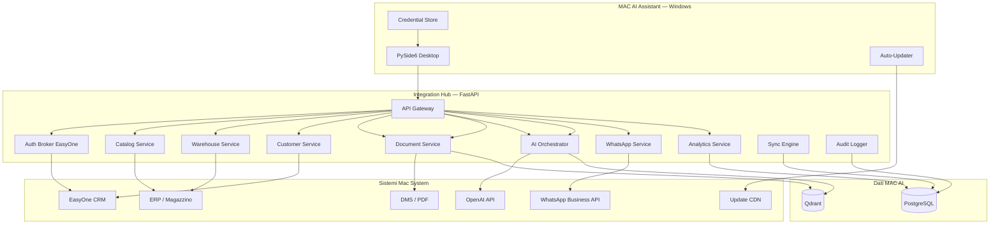
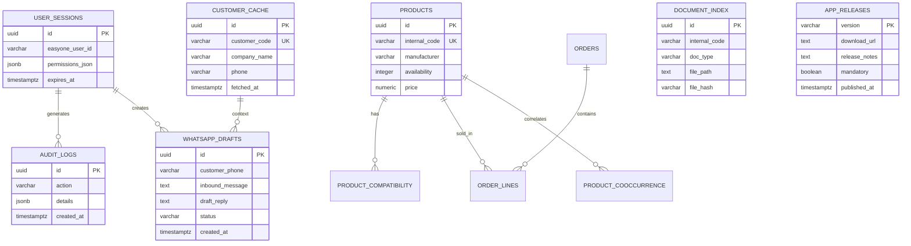
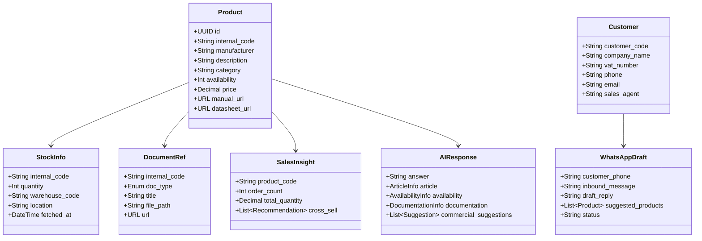
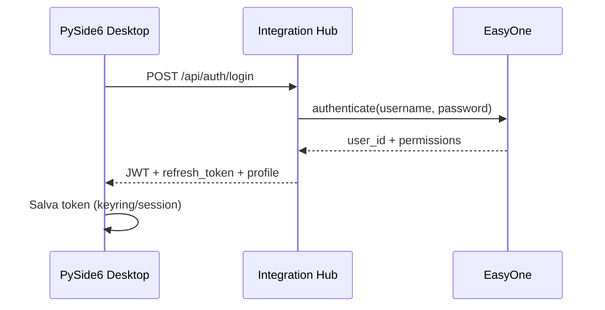
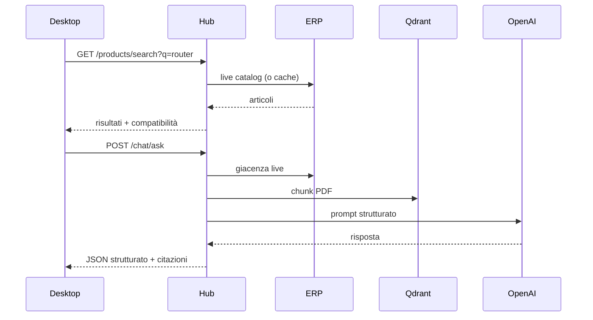
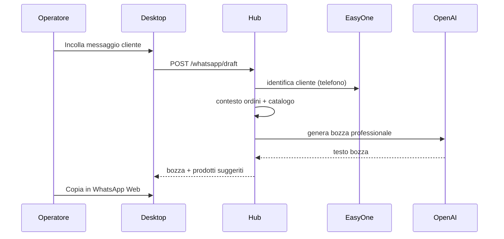

# MAC AI ASSISTANT
## Architettura Enterprise — Documento CTO

| Campo | Valore |
|---|---|
| **Prodotto** | MAC AI Assistant |
| **Tipo** | Piattaforma Windows integrata EasyOne + AI |
| **Stack** | Python · FastAPI · PostgreSQL · Qdrant · OpenAI · PySide6 |
| **Versione** | MVP 1.0 |
| **Data** | Giugno 2026 |

---

## 1. Executive summary

MAC AI Assistant è una **piattaforma unica Windows** (`Setup.exe`) per commerciale, magazzino e assistenza clienti. Centralizza:

- **EasyOne CRM** (auth, clienti, ordini)
- **ERP/Magazzino** (giacenze, listini)
- **Catalogo prodotti** (ricerca real-time)
- **Knowledge base PDF** (Qdrant + RAG)
- **WhatsApp Business** (bozze risposta AI)
- **Analytics vendite** (cross-sell, compatibilità)

**Principio architetturale:** Integration Hub on-prem come single API; client PySide6 thin; nessuna duplicazione inutile dei dati master.

---

## 2. Vista architetturale



---

## 3. Mapping requisiti → componenti

| # | Requisito | Componente | Fonte dati |
|---|---|---|---|
| 1 | Login EasyOne | `auth_service` + `easyone/auth_client` | EasyOne |
| 2 | Ricerca prodotti real-time | `catalog_service` + `product_service` | ERP/EasyOne live |
| 3 | Ricerca clienti | `customer_service` | EasyOne CRM |
| 4 | Disponibilità magazzino | `warehouse_service` | ERP live |
| 5 | Ricerca PDF | `document_service` + Qdrant RAG | DMS + indice |
| 6 | Assistente AI | `commercial_assistant_service` | Catalogo + PDF + AI |
| 7 | Storico vendite | `analytics_service` | Snapshot ordini |
| 8 | Suggerimenti | `recommendation_service` + `compatibility_service` | Ordini + regole |
| 9 | WhatsApp Business | `whatsapp_service` | Meta Cloud API |
| 10 | Bozze automatiche | `whatsapp_service` + OpenAI | Contesto CRM+catalogo |
| 11 | Apertura documenti | `document_service` | URL/file locali |
| 12 | Logging completo | `audit` middleware + `audit_logs` | PostgreSQL |
| 13 | Aggiornamenti auto | `update_service` + Inno Setup | CDN / server interno |

---

## 4. Diagramma componenti dettagliato

```mermaid
flowchart LR
    subgraph DesktopUI["PySide6 UI"]
        LOGIN[LoginDialog]
        MW[MainWindow]
        TAB1[Catalogo]
        TAB2[Clienti]
        TAB3[Magazzino]
        TAB4[Documenti]
        TAB5[Assistente AI]
        TAB6[Analytics]
        TAB7[WhatsApp]
    end

    subgraph HubAPI["FastAPI Routes"]
        R_AUTH[/auth]
        R_PROD[/products]
        R_CUST[/customers]
        R_WH[/warehouse]
        R_DOC[/documents]
        R_CHAT[/chat]
        R_COP[/commercial-copilot]
        R_REC[/recommendations]
        R_WA[/whatsapp]
        R_ANA[/analytics]
        R_UPD[/updates]
    end

    MW --> LOGIN
    MW --> TAB1 & TAB2 & TAB3 & TAB4 & TAB5 & TAB6 & TAB7
    DesktopUI --> HubAPI
```

---

## 5. Struttura cartelle

```
mac-ai-assistant/
├── README.md
├── docker-compose.yml
├── requirements.txt
├── .env.example
│
├── docs/
│   ├── MAC_AI_ENTERPRISE_ARCHITECTURE.md      # questo documento
│   ├── MAC_EASYONE_INTEGRATION_ARCHITECTURE.md
│   └── MAC_AI_ASSISTANT_SPEC.md
│
├── database/
│   ├── schema.sql
│   └── migrations/
│       ├── 005_auth_audit_cache.sql
│       └── 006_mvp_enterprise.sql
│
├── integration-hub/                    # Backend FastAPI (app/)
│   └── app/
│       ├── main.py
│       ├── api/routes/
│       │   ├── auth.py
│       │   ├── products.py
│       │   ├── customers.py
│       │   ├── warehouse.py
│       │   ├── documents.py
│       │   ├── chat.py
│       │   ├── commercial_copilot.py
│       │   ├── recommendations.py
│       │   ├── whatsapp.py
│       │   ├── analytics.py
│       │   └── updates.py
│       ├── services/
│       ├── integrations/
│       │   ├── easyone/
│       │   ├── openai/
│       │   ├── qdrant/
│       │   └── whatsapp/
│       ├── audit/
│       ├── cache/
│       └── sync/
│
├── desktop/                            # Client Windows PySide6
│   ├── requirements.txt
│   ├── mac_ai_assistant/
│   │   ├── __main__.py
│   │   ├── config.py
│   │   ├── api/hub_client.py
│   │   └── ui/
│   │       ├── main_window.py
│   │       ├── login_dialog.py
│   │       └── pages/
│   └── installer/
│       └── setup.iss
│
├── documents/                          # PDF da indicizzare
└── scripts/
    ├── init_db.py
    ├── run_hub.py
    └── run_desktop.py
```

> **Nota:** il repository attuale usa `app/` come hub; `desktop/` è il client PySide6 MVP.

---

## 6. Schema database

### 6.1 Diagramma ER



### 6.2 Tabelle per layer

| Layer | Tabelle | Ruolo |
|---|---|---|
| **Auth** | `user_sessions`, `audit_logs` | Sessioni EasyOne, audit |
| **Cache** | `cache_entries`, `customer_cache`, `search_index_products` | Performance, non master |
| **Catalogo** | `products`, `product_compatibility` | Cache/indice + regole |
| **Vendite** | `orders`, `order_lines`, `product_cooccurrence` | Analytics |
| **Documenti** | `document_index` + Qdrant `document_chunks` | Metadati + vettori |
| **WhatsApp** | `whatsapp_drafts` | Bozze e storico |
| **Updates** | `app_releases` | Versioning auto-update |

---

## 7. Modello dati (dominio)



---

## 8. Flussi principali

### 8.1 Login e sessione



### 8.2 Ricerca prodotto + AI



### 8.3 WhatsApp bozza automatica



---

## 9. Piano di sviluppo

| Fase | Durata | Deliverable | Stato |
|---|---|---|---|
| **MVP 1** | 8 sett. | Hub + PySide6 + auth + catalogo + magazzino + AI + PDF | **In corso** |
| **MVP 2** | 6 sett. | Clienti live EasyOne + analytics + WhatsApp draft | Pianificato |
| **Beta** | 4 sett. | Setup.exe firmato + auto-update + UAT | Pianificato |
| **v1.0** | 4 sett. | ERP live + WhatsApp API + hardening | Pianificato |

### MVP 1 scope (questa release)

- [x] Auth EasyOne (dev + HTTP ready)
- [x] Ricerca prodotti + compatibilità
- [x] Giacenze
- [x] Ricerca documenti PDF
- [x] Assistente AI strutturato
- [x] Analytics storico base
- [x] Bozze WhatsApp (draft AI, invio manuale)
- [x] Client PySide6 tabbed
- [x] Audit logging
- [ ] Setup.exe firmato (stub Inno Setup)
- [ ] Auto-update produzione (check endpoint)

---

## 10. Rischi e mitigazioni

| Rischio | Impatto | Mitigazione |
|---|---|---|
| API EasyOne non documentate | Alto | Dual-adapter ERP + dev mock |
| WhatsApp policy Meta | Medio | MVP: bozze + copia manuale |
| Latenza ERP | Medio | Cache TTL differenziata |
| OpenAI costi/latenza | Medio | gpt-4o-mini, caching prompt |
| Distribuzione Windows | Basso | Inno Setup + firma code signing |

---

## 11. Decisioni tecnologiche CTO

| Decisione | Scelta | Motivazione |
|---|---|---|
| Desktop framework | **PySide6** | Nativo Windows, team Python, footprint ridotto vs Electron |
| API style | REST JSON | Semplice, debuggabile, PySide6-friendly |
| Auth | JWT + sessioni PG | Stateless client, revoca server-side |
| PDF search | Qdrant RAG | Semantic search su manuali |
| WhatsApp MVP | Draft AI only | Evita complessità approvazione Meta in fase 1 |
| Updates | Semver + endpoint | Delta update in v1.1 |

---

*MAC AI Assistant — Enterprise Architecture v1.0*
