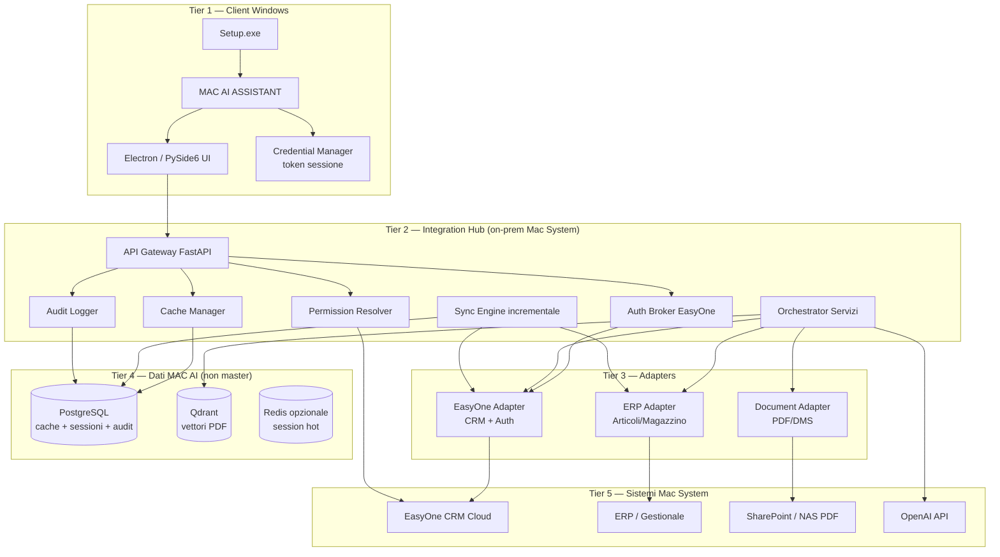
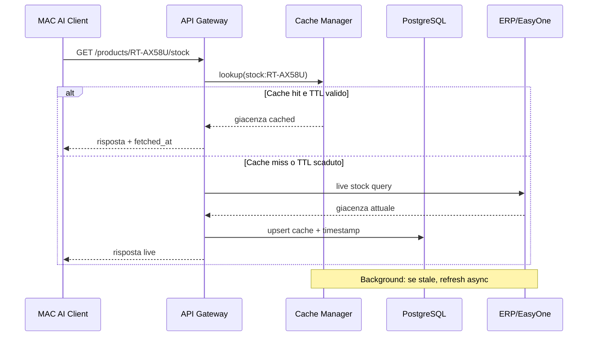
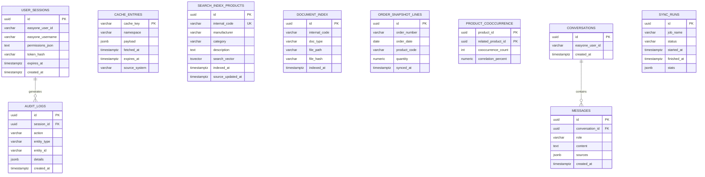
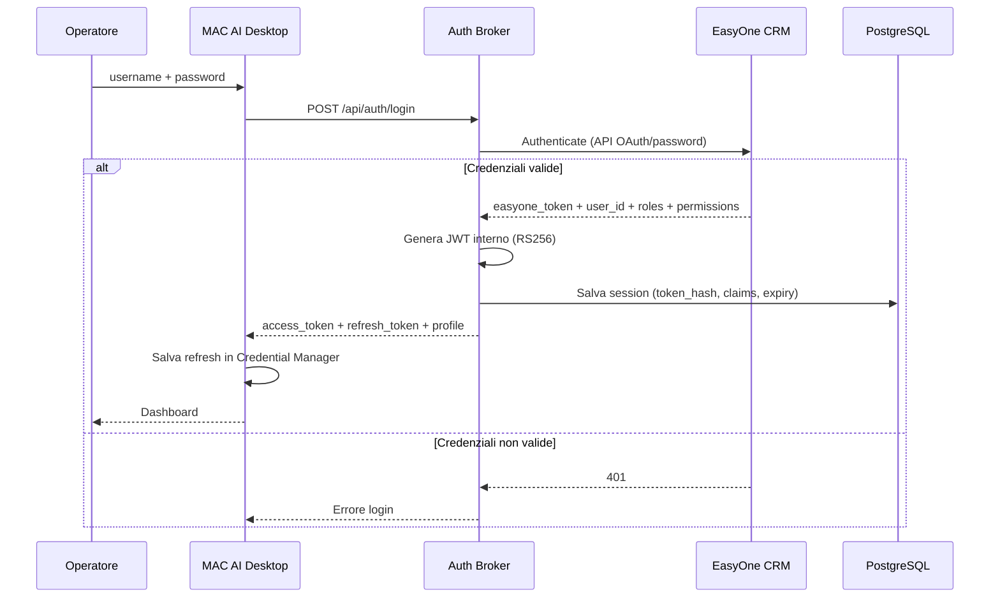
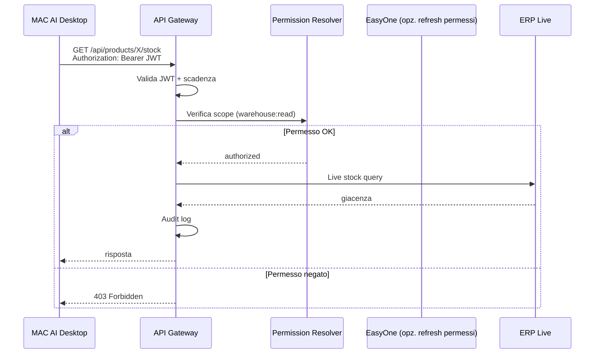
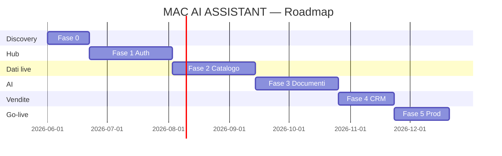
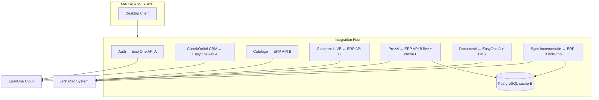
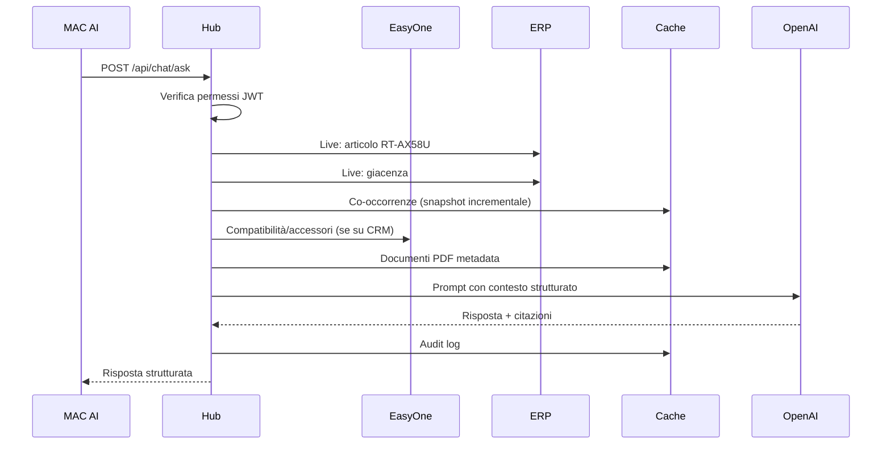

# MAC AI ASSISTANT
## Architettura di integrazione EasyOne CRM

| Campo | Valore |
|---|---|
| **Prodotto** | MAC AI ASSISTANT |
| **Cliente** | Mac System |
| **Integrazione target** | EasyOne CRM (+ ERP sottostante) |
| **Versione** | 1.0 |
| **Ruolo** | Senior ERP Integration Architecture |
| **Data** | Giugno 2026 |

---

## Executive summary

MAC AI ASSISTANT è un client Windows (`Setup.exe`) per commerciale e magazzino. **Non gestisce utenti locali**: autentica tramite EasyOne e eredita permessi. I dati operativi (articoli, giacenze, prezzi, ordini) vengono letti **in tempo reale** da EasyOne/ERP quando possibile; PostgreSQL e Qdrant fungono da **cache intelligente** e **indice AI**, non da replica completa del gestionale.

**Nota critica:** EasyOne ([easyone.biz](https://www.easyone.biz/), Gruppo Buffetti) è una **piattaforma CRM cloud** con connettori verso ERP italiani (TeamSystem, Zucchetti, Sage X3, Arca, NTS, ecc.). L'integrazione MAC AI deve coinvolgere **EasyOne per auth/CRM** e molto probabilmente l'**ERP collegato** per dati magazzino/listini. L'Integration Hub unifica entrambe le fonti dietro un'unica API.

---

## 1. Architettura completa

### 1.1 Principi architetturali

| Principio | Implementazione |
|---|---|
| **Single source of truth** | EasyOne/ERP = master; MAC AI non duplica anagrafiche |
| **Read real-time first** | Giacenze, prezzi cliente, ordini aperti → live API |
| **Cache on purpose** | Solo ciò che serve a performance e AI (indici, sessioni, audit) |
| **No local users** | Auth delegata a EasyOne; zero tabella `users` applicativa |
| **Fail safe** | Cache stale con timestamp; mai dati inventati dall'AI |
| **Audit by design** | Ogni accesso a prezzi, clienti, margini tracciato |

### 1.2 Vista logica a layer



### 1.3 Cosa NON duplicare vs cosa cacheare

| Dato | Duplicare? | Strategia |
|---|---|---|
| Articoli anagrafica completa | **No** (solo indice ricerca) | Live + cache TTL 1–4h per search |
| Giacenze / ubicazioni | **No** | **Sempre live** da ERP |
| Prezzi / listini base | **No** | Live o cache TTL 5–15 min |
| Prezzi cliente / sconti | **No** | **Live** con codice cliente |
| Clienti anagrafica | **No** | Live da EasyOne/ERP; cache query recenti |
| Ordini aperti | **No** | Live |
| Storico vendite (analisi) | **Parziale** | Snapshot incrementale notturno per ML/cross-sell |
| PDF / manuali | **Sì (indice)** | File su DMS; testo chunk in Qdrant |
| Utenti / permessi | **No** | JWT sessione + claims da EasyOne |
| Conversazioni AI | **Sì** | PostgreSQL (retention policy) |
| Audit log | **Sì** | PostgreSQL append-only |

### 1.4 Pattern: Cache-aside con stale-while-revalidate



---

## 2. Diagramma dei componenti


### 2.1 Responsabilità componenti

| Componente | Responsabilità |
|---|---|
| **auth_service** | Login EasyOne, refresh token, logout, claims permessi |
| **catalog_service** | Ricerca articoli live + indice cache full-text |
| **warehouse_service** | Giacenze, depositi, ubicazioni — sempre live |
| **document_service** | Metadati documenti EasyOne/ERP + link PDF |
| **commercial_assistant_service** | Chat AI multi-sorgente |
| **commercial_copilot_service** | Analisi commerciale per articolo |
| **recommendation_service** | Cross-sell da storico (snapshot incrementale) |
| **sync_service** | ETL incrementale notturno (solo dati analitici) |
| **audit_service** | Log accessi e query sensibili |

---

## 3. Struttura cartelle

```
mac-ai-assistant/
│
├── README.md
├── docker-compose.yml              # PostgreSQL, Qdrant, Hub (dev/prod)
├── .env.example
├── requirements.txt
├── pyproject.toml
│
├── docs/
│   ├── MAC_AI_ASSISTANT_SPEC.md
│   ├── MAC_EASYONE_INTEGRATION_ARCHITECTURE.md   # questo documento
│   ├── easyone-api-mapping.md                    # da compilare con vendor
│   └── deployment-windows.md
│
├── database/
│   ├── schema.sql                  # solo cache, sessioni, audit, AI
│   └── migrations/
│
├── integration-hub/                # Backend FastAPI (Python 3.12)
│   ├── app/
│   │   ├── main.py
│   │   ├── config/settings.py
│   │   │
│   │   ├── api/
│   │   │   ├── router.py
│   │   │   ├── dependencies.py     # JWT + permessi
│   │   │   └── routes/
│   │   │       ├── auth.py
│   │   │       ├── products.py
│   │   │       ├── warehouse.py
│   │   │       ├── customers.py
│   │   │       ├── orders.py
│   │   │       ├── documents.py
│   │   │       ├── chat.py
│   │   │       ├── commercial_copilot.py
│   │   │       ├── recommendations.py
│   │   │       ├── sync.py         # admin sync trigger
│   │   │       └── health.py
│   │   │
│   │   ├── core/
│   │   │   ├── security.py         # JWT, hashing
│   │   │   ├── permissions.py      # RBAC da EasyOne claims
│   │   │   ├── exceptions.py
│   │   │   └── logging.py
│   │   │
│   │   ├── integrations/
│   │   │   ├── easyone/
│   │   │   │   ├── auth_client.py      # Login OAuth/password
│   │   │   │   ├── session_client.py
│   │   │   │   ├── users_client.py     # Profilo + permessi
│   │   │   │   ├── products_client.py  # Se esposto da EasyOne
│   │   │   │   ├── customers_client.py
│   │   │   │   ├── orders_client.py
│   │   │   │   └── documents_client.py
│   │   │   ├── erp/                    # Gestionale sottostante
│   │   │   │   ├── adapter_factory.py
│   │   │   │   ├── teamsystem/
│   │   │   │   ├── zucchetti/
│   │   │   │   └── generic_sql/        # fallback read-only
│   │   │   ├── openai/
│   │   │   └── qdrant/
│   │   │
│   │   ├── services/                   # logica business
│   │   ├── repositories/               # solo cache PostgreSQL
│   │   ├── models/
│   │   ├── schemas/
│   │   ├── cache/
│   │   │   ├── manager.py
│   │   │   ├── keys.py
│   │   │   └── ttl_policy.py
│   │   ├── sync/
│   │   │   ├── incremental_sync.py
│   │   │   ├── order_snapshot.py
│   │   │   └── index_builder.py
│   │   └── audit/
│   │       ├── logger.py
│   │       └── middleware.py
│   │
│   └── tests/
│
├── desktop/                            # Client Windows
│   ├── electron/                       # oppure pyside6/
│   │   ├── package.json
│   │   ├── src/
│   │   │   ├── main/                   # processo main Electron
│   │   │   ├── renderer/               # React UI
│   │   │   │   ├── pages/
│   │   │   │   │   ├── Login.tsx
│   │   │   │   │   ├── Catalog.tsx
│   │   │   │   │   ├── Warehouse.tsx
│   │   │   │   │   ├── Documents.tsx
│   │   │   │   │   ├── Chat.tsx
│   │   │   │   │   └── Copilot.tsx
│   │   │   │   └── api/hubClient.ts
│   │   │   └── preload/                # bridge sicuro
│   │   └── assets/
│   └── pyside6/                        # alternativa nativa Qt
│       ├── main.py
│       └── ui/
│
├── installer/
│   ├── setup.iss                       # Inno Setup
│   ├── setup.wxs                       # alternativa WiX
│   └── assets/logo.bmp
│
└── scripts/
    ├── init_db.py
    ├── run_sync.py
    ├── index_documents.py
    └── health_check.py
```

---

## 4. Schema database (PostgreSQL — solo cache e metadati)

> PostgreSQL **non** è il database master degli articoli. Contiene indici, sessioni, audit e dati analitici derivati.

### 4.1 Diagramma ER



### 4.2 SQL schema essenziale

```sql
-- SESSIONI (no utenti locali — solo sessioni EasyOne)
CREATE TABLE user_sessions (
    id              UUID PRIMARY KEY DEFAULT gen_random_uuid(),
    easyone_user_id VARCHAR(100) NOT NULL,
    easyone_username VARCHAR(200) NOT NULL,
    display_name    VARCHAR(200),
    roles_json      JSONB NOT NULL DEFAULT '[]',
    permissions_json JSONB NOT NULL DEFAULT '[]',
    token_hash      VARCHAR(64) NOT NULL,
    refresh_token_hash VARCHAR(64),
    expires_at      TIMESTAMPTZ NOT NULL,
    created_at      TIMESTAMPTZ NOT NULL DEFAULT NOW(),
    last_activity   TIMESTAMPTZ NOT NULL DEFAULT NOW()
);

-- CACHE GENERICA (pattern cache-aside)
CREATE TABLE cache_entries (
    cache_key       VARCHAR(500) PRIMARY KEY,
    namespace       VARCHAR(100) NOT NULL,  -- stock, price, customer, product
    payload         JSONB NOT NULL,
    fetched_at      TIMESTAMPTZ NOT NULL,
    expires_at      TIMESTAMPTZ NOT NULL,
    source_system   VARCHAR(50) NOT NULL,   -- easyone, erp
    stale_after     TIMESTAMPTZ
);
CREATE INDEX idx_cache_namespace ON cache_entries(namespace);
CREATE INDEX idx_cache_expires ON cache_entries(expires_at);

-- INDICE RICERCA (non replica completa anagrafica)
CREATE TABLE search_index_products (
    id                  UUID PRIMARY KEY DEFAULT gen_random_uuid(),
    internal_code       VARCHAR(50) NOT NULL UNIQUE,
    manufacturer        VARCHAR(200),
    category            VARCHAR(200),
    description         TEXT,
    search_vector       TSVECTOR,
    source_updated_at   TIMESTAMPTZ,
    indexed_at          TIMESTAMPTZ NOT NULL DEFAULT NOW()
);

-- SNAPSHOT ORDINI (solo per analisi cross-sell — sync incrementale)
CREATE TABLE order_snapshot_lines (
    id              UUID PRIMARY KEY DEFAULT gen_random_uuid(),
    order_number    VARCHAR(50) NOT NULL,
    order_date      DATE NOT NULL,
    customer_code   VARCHAR(50),
    product_code    VARCHAR(50) NOT NULL,
    quantity        NUMERIC(10,2) NOT NULL,
    unit_price      NUMERIC(12,2),
    synced_at       TIMESTAMPTZ NOT NULL DEFAULT NOW()
);
CREATE INDEX idx_order_snapshot_product ON order_snapshot_lines(product_code);

-- AUDIT (append-only)
CREATE TABLE audit_logs (
    id              UUID PRIMARY KEY DEFAULT gen_random_uuid(),
    session_id      UUID REFERENCES user_sessions(id),
    easyone_user_id VARCHAR(100) NOT NULL,
    action          VARCHAR(100) NOT NULL,
    entity_type     VARCHAR(50),
    entity_id       VARCHAR(100),
    details         JSONB,
    ip_address      VARCHAR(45),
    created_at      TIMESTAMPTZ NOT NULL DEFAULT NOW()
);
CREATE INDEX idx_audit_user ON audit_logs(easyone_user_id, created_at DESC);

-- SYNC RUNS
CREATE TABLE sync_runs (
    id              UUID PRIMARY KEY DEFAULT gen_random_uuid(),
    job_name        VARCHAR(100) NOT NULL,
    status          VARCHAR(20) NOT NULL,
    started_at      TIMESTAMPTZ NOT NULL DEFAULT NOW(),
    finished_at     TIMESTAMPTZ,
    stats           JSONB
);
```

### 4.3 Qdrant (solo AI documentale)

| Collection | Contenuto | Source |
|---|---|---|
| `document_chunks` | Chunk PDF schede/manuali | DMS / EasyOne allegati |
| `products` (opzionale) | Embedding descrizioni per ricerca semantica | Sync leggero da ERP |

---

## 5. Flussi di autenticazione

### 5.1 Login con credenziali EasyOne



### 5.2 Richiesta API con permessi



### 5.3 Refresh sessione

| Step | Azione |
|---|---|
| 1 | App rileva JWT in scadenza (< 5 min) |
| 2 | `POST /api/auth/refresh` con refresh_token |
| 3 | Hub valida refresh_hash in PostgreSQL |
| 4 | Opzionale: re-validazione permessi su EasyOne |
| 5 | Nuovo access_token emesso |

### 5.4 Mapping permessi EasyOne → scopes MAC AI

| Permesso EasyOne (esempio) | Scope MAC AI |
|---|---|
| `catalogo.lettura` | `products:read` |
| `magazzino.lettura` | `warehouse:read` |
| `listini.lettura` | `pricing:read` |
| `listini.margine` | `pricing:margin` |
| `clienti.lettura` | `customers:read` |
| `ordini.lettura` | `orders:read` |
| `documenti.lettura` | `documents:read` |
| `ai.chat` | `ai:chat` |

> Mapping reale da definire con documentazione EasyOne Mac System.

---

## 6. Piano di sviluppo

### Fase 0 — Discovery (3 settimane)

| Attività | Output |
|---|---|
| Workshop con Buffetti/EasyOne + rivenditore ERP | Documentazione API |
| Inventario permessi EasyOne Mac System | Matrice RBAC |
| Proof of concept login EasyOne | Auth funzionante |
| Scelta desktop: Electron vs PySide6 | Decision record |

### Fase 1 — Integration Hub + Auth (6 settimane)

- FastAPI Hub deploy on-prem
- `easyone/auth_client` reale
- JWT + sessioni PostgreSQL
- Audit middleware
- Health check + logging strutturato
- Desktop: schermata login + shell app

### Fase 2 — Catalogo e magazzino live (6 settimane)

- `erp/products_client` live
- `erp/stock_client` live (no cache su giacenza)
- Cache-aside per ricerca (search_index)
- Desktop: catalogo + scheda articolo + giacenze
- Setup.exe v0.1

### Fase 3 — Documenti + AI (6 settimane)

- Document adapter (EasyOne + DMS)
- Pipeline PDF → Qdrant
- Chat AI con risposte strutturate
- Commercial Copilot
- Domande: "Dove trovo X?", "Mostrami il manuale"

### Fase 4 — Vendite e CRM (4 settimane)

- Clienti e ordini live
- Sync incrementale storico ordini (notturno)
- Cross-sell / compatibilità
- Domande: "Accessori con Y?", "Alternativa?"

### Fase 5 — Produzione (4 settimane)

- Hardening sicurezza
- UAT Mac System
- Firma digitale Setup.exe
- Documentazione utente
- Go-live

**Durata totale:** ~29 settimane (~7 mesi)



---

## 7. Rischi tecnici

| ID | Rischio | Prob. | Impatto | Mitigazione |
|---|---|---|---|---|
| R1 | **API EasyOne non pubbliche** | Alta | Alto | Partner program Buffetti; fallback ERP diretto per dati operativi |
| R2 | EasyOne = CRM, non ERP completo | Alta | Alto | Architecture Hub dual-adapter (EasyOne + ERP) |
| R3 | Latenza live su picchi | Media | Medio | Cache TTL differenziata; circuit breaker |
| R4 | Permessi EasyOne non granulari | Media | Alto | Mapping custom; gruppi Mac System |
| R5 | OpenAI bloccato da IT | Media | Alto | Azure OpenAI EU; fallback modello locale |
| R6 | PDF non collegati ad articoli | Alta | Medio | ETL mapping; regole nome file; intervento manuale |
| R7 | Duplicazione dati incontr rollata | Media | Medio | Governance schema: solo cache + indici |
| R8 | Session hijacking desktop | Bassa | Alto | Credential Manager; JWT breve; HTTPS only |
| R9 | ERP legacy senza API | Media | Alto | Read replica SQL + viste; file exchange |
| R10 | Scope creep integrazione | Alta | Medio | Fuori scope v1: scrittura ordini |

---

## 8. Modalità di integrazione con EasyOne

### 8.1 Matrice opzioni

| Modalità | Dati | Auth | Real-time | Complessità | Raccomandazione |
|---|---|---|---|---|---|
| **A. API REST EasyOne ufficiale** | CRM, permessi, allegati | OAuth2 / API key | Sì | Media | **Preferita** se disponibile |
| **B. API ERP sottostante** | Articoli, giacenze, ordini | Service account | Sì | Media-Alta | **Obbligatoria** per magazzino |
| **C. Connettore EasyOne→ERP (esistente)** | Indiretto | N/A | Dipende | Bassa | Usare come riferimento flussi |
| **D. Webhook EasyOne** | Eventi ordini/clienti | HMAC secret | Quasi real-time | Media | Complementare per sync |
| **E. Cache PostgreSQL + live selettivo** | Tutti | Via Hub | Ibrido | Media | **Architettura target** |
| **F. Read replica DB ERP** | Operativi completi | SQL user RO | Sì | Alta | Fallback se no API |
| **G. File CSV/XML schedulato** | Anagrafiche | N/A | No | Bassa | Solo emergenza / batch |

### 8.2 Architettura integrazione raccomandata (ibrida A + B + E)



### 8.3 Flusso dati per domanda AI tipica

**"Quali accessori vengono normalmente acquistati assieme al router RT-AX58U?"**



### 8.4 Politica TTL cache consigliata

| Namespace | TTL live | Stale-while-revalidate | Note |
|---|---|---|---|
| `stock:{code}` | 0 (sempre live) | — | Mai cache persistente |
| `price:{code}` | 5 min | 15 min | Refresh background |
| `price:{code}:{customer}` | 0 | — | Sempre live |
| `product:{code}` | 1 h | 4 h | Anagrafica |
| `customer:{code}` | 15 min | 1 h | CRM |
| `search_index` | 2 h | 6 h | Full-text locale |
| `order_snapshot` | 24 h | — | Solo batch notturno |

---

## 9. Applicazione Windows (Setup.exe)

### 9.1 Scelta tecnologia desktop

| Criterio | Electron + React | PySide6 |
|---|---|---|
| UI moderna | Eccellente | Buona |
| Footprint | ~150 MB | ~50 MB |
| Velocità sviluppo | Alta | Media |
| Integrazione team Python | Media | **Alta** |
| WebView2 | Sì | N/A (Qt nativo) |

**Raccomandazione Mac System:** **Electron + React** se priorità UX; **PySide6** se team principalmente Python e footprint ridotto.

### 9.2 Installer

- Tool: **Inno Setup 6**
- Output: `MAC_AI_ASSISTANT_Setup.exe`
- Firma: certificato code signing Mac System
- Prerequisiti: WebView2 (Electron), VC++ redist se necessario
- Config post-install: URL Integration Hub (es. `https://hub.macsystem.local`)

---

## 10. Allineamento con codice esistente

Il repository `tech-distributor-assistant` implementa già:

| Modulo | Stato | Evoluzione per EasyOne |
|---|---|---|
| Commercial Copilot | ✅ | Sostituire `LocalEasyOneAdapter` con client HTTP |
| Chat AI strutturata | ✅ | Aggiungere auth JWT |
| Raccomandazioni cross-sell | ✅ | Sync da ERP invece di Excel |
| Compatibilità | ✅ | Import da EasyOne/ERP |
| RAG PDF | ✅ | Document adapter DMS |
| Auth locale | ❌ | Da implementare `auth_service` |
| Cache policy | Parziale | Refactor verso `cache_entries` |
| Audit | ❌ | Da implementare |

---

## 11. Checklist pre-avvio sviluppo

- [ ] Confermare versione EasyOne e piano Buffetti
- [ ] Identificare ERP sottostante Mac System
- [ ] Ottenere documentazione API EasyOne (partner/ISV)
- [ ] Ottenere documentazione API ERP
- [ ] Definire matrice permessi ruoli Mac System
- [ ] Approvare policy OpenAI / Azure OpenAI
- [ ] Scegliere Electron vs PySide6
- [ ] Provisionare server Integration Hub on-prem
- [ ] Definire URL hub e certificati TLS interni

---

*Documento architetturale MAC AI ASSISTANT — Integrazione EasyOne CRM*  
*Versione 1.0 — per approvazione Mac System e team integrazione*
